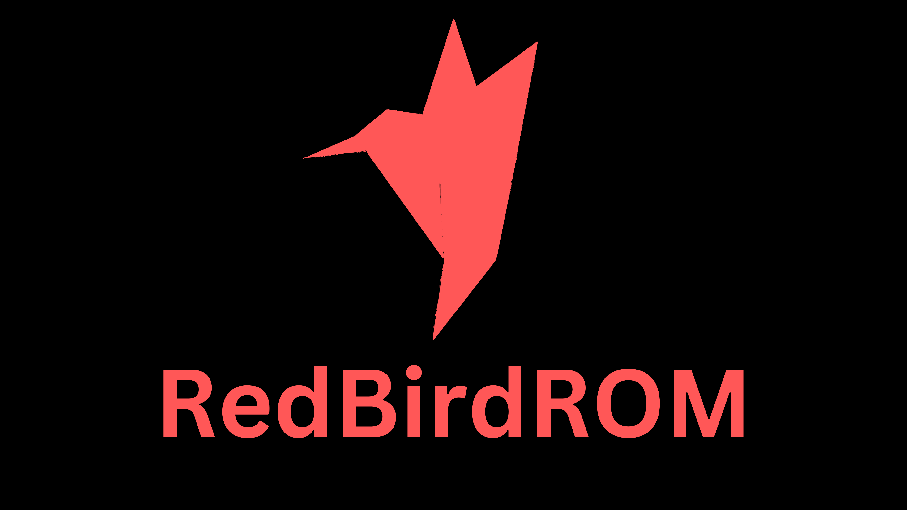

# Getting started with RedBirdROM

**You can find the XDA template here:** [Click Me!](XDA_ThreadTemplate.txt)

# Maintainership Application

**To make your device official and be the official maintainer, you must fulfill all the requirements as mentioned below.**

## Requirements:

-   Applicant should be having a good knowledge over the use of GitHub and Gerrit.
-   A proper commit history with authorship should be maintained for all of the commits being done or cherry-picked.
-   The [build variant](https://source.android.com/setup/build/building#choose-a-target) should be *user* (redbird_device-user) or *userdebug* (redbird_device-userdebug).
-   People maintaining more than 2 ROMs won't be allowed.
-   Applicant should have a Telegram Account to be in touch with the [team](https://t.me/project_404) .
-   Be respectful towards everyone and don't spread hate.

**Contact Us on Telegram for maintainership:** Just contact us on Telegram for now.

# Contact Us

**Telegram:** [@RedBirdROM](https://t.me/RedBirdROM)

